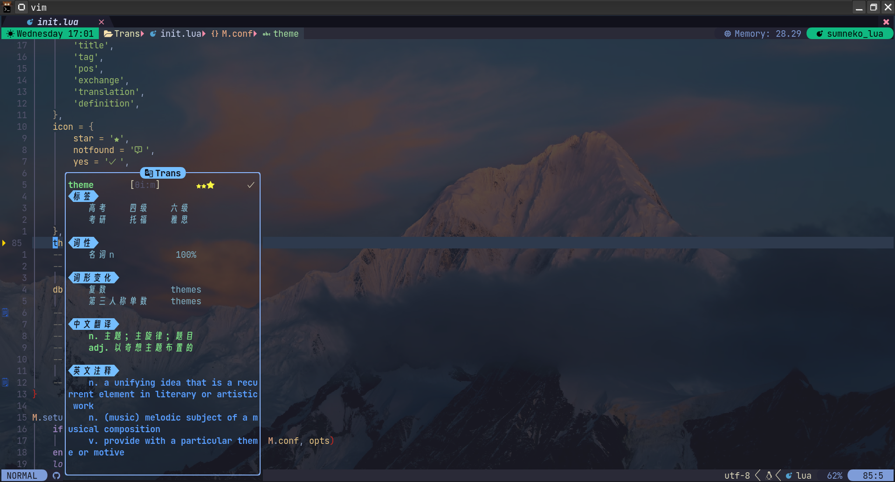
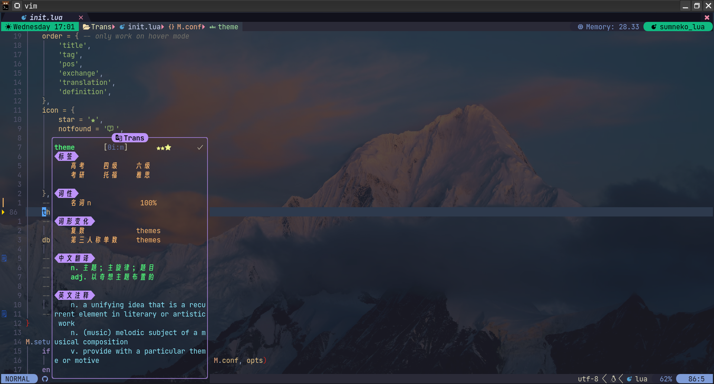
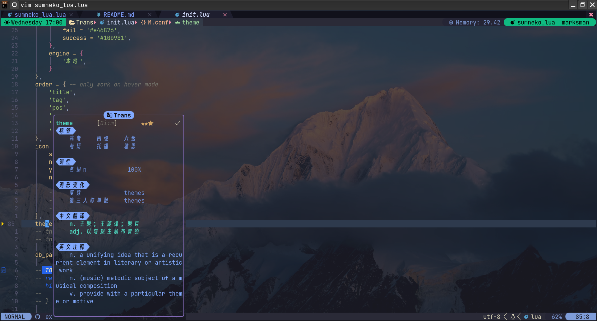

# Trans.nvim

<!--toc:start-->

-   [Trans.nvim](#transnvim)
    -   [特点](#特点)
    -   [屏幕截图](#屏幕截图)
        -   [演示](#演示)
        -   [离线查询](#离线查询)
        -   [在线查询演示 (有道)](#在线查询演示-有道)
        -   [主题](#主题)
    -   [安装](#安装)
    -   [配置](#配置)
    -   [快捷键绑定](#快捷键绑定)
    -   [高亮组](#高亮组)
    -   [声明](#声明)
    -   [感谢](#感谢)
    -   [贡献](#贡献)
    -   [从 v1 (main)分支迁移](#从-v1-main分支迁移)
    -   [待办 (画大饼)](#待办-画大饼)
    -   [项目情况](#项目情况)
    <!--toc:end-->

> **插件默认词库的路径为插件目录**

    例如: `lazy` 用户应该在 `$HOME/.local/share/nvim/lazy/Trans.nvim`

## 特点

-   `使用纯 lua 编写`
-   大部分功能可以自定义:
    -   🔍 高亮
    -   👀 悬浮大小
    -   📜 排版顺序
    -   💬 弹窗大小
    -   🎉 舒服窗口动画
    -   更多可以查看[配置](#配置)
-   `离线`和`在线`翻译的支持
-   支持显示:
    -   🌟 柯林斯星级
    -   📚 牛津 3000 词汇
    -   🇨🇳 中文翻译
    -   🇺🇸 英文翻译 (不是英译中, 而是用英文解释)
    -   🌱 词根
    -   etc
-   支持`平滑动画`
-   支持 `normal`和 `visual`模式
    > <font color='#FF9900'>不支持 visual-block mode</font>
-   本地词库单词量: `430w`

## 屏幕截图

### 演示

> 可以点开声音查看离线自动发音

### 离线查询

https://user-images.githubusercontent.com/107862700/226175984-1a95bea7-8d66-450e-87e1-ba9c91c37ab8.mp4

### 在线查询演示 (有道)

https://user-images.githubusercontent.com/107862700/226176106-c2962dd3-d66c-499c-b44a-1f471b79fe38.mp4

**使用在线查询需要配置相应的 app_id 和 app_passwd**

配置说明见: [wiki](https://github.com/JuanZoran/Trans.nvim/wiki/%E9%85%8D%E7%BD%AE#%E5%9C%A8%E7%BA%BF%E6%9F%A5%E8%AF%A2%E9%85%8D%E7%BD%AE)

### 主题

> 如果你有更美观或者更适合的配色, 欢迎提 PR  
> 主题配色在: `lua/Trans/theme.lua`文件中，你只需要添加你主题的表就可以了

-   `default`
    

-   `dracula`
    

-   `tokyonight`
    

## 安装

_安装之前, 首先需要明确本插件的依赖:_

-   [ECDICT](https://github.com/skywind3000/ECDICT): 插件所用的离线单词数据库
-   sqlite3: 数据库
-   `espeak` (仅 Linux auto_play)

<details>
    <summary>Packer.nvim</summary>

```lua
use {
    'JuanZoran/Trans.nvim'
    run = function() require('Trans').install() end, -- 自动下载使用的本地词库
    -- 如果你不需要任何配置的话, 可以直接按照下面的方式启动
    config = function ()
        require'Trans'.setup{
            -- your configuration here
        }
    end
}
```

**如果你想要使用 Packer 的惰性加载，这里有一个例子**

```lua
use {
    "JuanZoran/Trans.nvim",
    keys = {
        { {'n', 'x'}, 'mm' }, -- 换成其他你想用的key即可
        { {'n', 'x'}, 'mk' },
        { 'n', 'mi' },
    },
    run = function() require('Trans').install() end, -- 自动下载使用的本地词库
    config = function()
        require("Trans").setup {
            -- your configuration here
        }
        vim.keymap.set({"n", 'x'}, "mm", '<Cmd>Translate<CR>') -- 自动判断visual 还是 normal 模式
        vim.keymap.set({'n', 'x'}, 'mk', '<Cmd>TransPlay<CR>') -- 自动发音选中或者光标下的单词
        vim.keymap.set('n', 'mi', '<Cmd>TransInput<CR>')
    end
}
```

</details>

<details>
    <summary>Lazy.nvim</summary>

```lua
    {
        "JuanZoran/Trans.nvim",
        build = function () require'Trans'.install() end,
        keys = {
        -- 可以换成其他你想映射的键
            { 'mm', mode = { 'n', 'x' }, '<Cmd>Translate<CR>', desc = ' Translate' },
            { 'mk', mode = { 'n', 'x' }, '<Cmd>TransPlay<CR>', desc = ' Auto Play' },
            -- 目前这个功能的视窗还没有做好，可以在配置里将view.i改成hover
            { 'mi', '<Cmd>TranslateInput<CR>', desc = ' Translate From Input' },
        },
        opts = {
            -- your configuration there
        }
    }
```

</details>

<font color="#FF9900">**注意事项**: </font>

-   下载词典的过程中, 需要能够 `流畅的访问github下载`

    如果下载出现问题, 正常是会自动下载

    > 词库文件压缩包大小为: **281M**  
    > 解压缩后的大小大概为: **1.2G**

-   安装后如果不能正常运行, 清尝试运行 `checkhealth Trans`

-   **`auto_play`** 的使用:

    -   `Linux` 需要安装`espeak`

        > `sudo apt-get install espeak`

        **可以通过参数改变语音，例如:** `espeak -v en+f3 'text'`

    -   `Termux` 需要安装`termux-api`

    -   `Mac` 使用系统的`say`命令

    -   `Windows` 使用 `nodejs`的 say 模块, 如果你有更好的方案欢迎提供 PR
        -   需要确保安装了`nodejs`
        -   进入插件的`tts`目录运行`npm install`
            > 如果`install`运行正常则自动安装，如果安装失败，请尝试手动安装

-   `title`的配置，只对`neovim 0.9+`版本有效

<!-- festival instructions retired; espeak used instead -->

## 配置

详细见**wiki**: [基本配置说明](https://github.com/JuanZoran/Trans.nvim/wiki/%E9%85%8D%E7%BD%AE)

<details>
    <summary>默认配置</summary>

```lua
default_conf = {
    ---@type string the directory for database file and password file
    dir      = require 'Trans'.plugin_dir,
    debug    = true,
    ---@type 'default' | 'dracula' | 'tokyonight' global Trans theme [see lua/Trans/style/theme.lua]
    theme    = 'default', -- default | tokyonight | dracula
    strategy = {
        ---@type { frontend:string, backend:string | string[] } fallback strategy for mode
        default = {
            frontend = 'hover',
            backend = '*',
        },
    },
    ---@type table frontend options
    frontend = {
        ---@class TransFrontendOpts
        ---@field keymaps table<string, string>
        default = {
            query     = 'fallback',
            border    = 'rounded',
            title     = vim.fn.has 'nvim-0.9' == 1 and {
                    { '',       'TransTitleRound' },
                    { ' Trans', 'TransTitle' },
                    { '',       'TransTitleRound' },
                } or nil, -- need nvim-0.9+
            auto_play = true,
            ---@type {open: string | boolean, close: string | boolean, interval: integer} Hover Window Animation
            animation = {
                open = 'slid', -- 'fold', 'slid'
                close = 'slid',
                interval = 12,
            },
            timeout   = 2000,
        },
        ---@class TransHoverOpts : TransFrontendOpts
        hover = {
            ---@type integer Max Width of Hover Window
            width             = 37,
            ---@type integer Max Height of Hover Window
            height            = 27,
            ---@type string -- see: /lua/Trans/style/spinner
            spinner           = 'dots',
            ---@type string
            fallback_message  = '{{notfound}} 翻译超时或没有找到相关的翻译',
            auto_resize       = true,
            split_width       = 60,
            padding           = 10, -- padding for hover window width
            keymaps           = {
                -- INFO : No default keymaps anymore, please set it yourself
                -- pageup       = '<C-u>',
                -- pagedown     = '<C-d>',
                -- pin          = '<leader>[',
                -- close        = '<leader>]',
                -- toggle_entry = '<leader>;',

                -- play         = '_', -- Deprecated
            },
            ---@type string[] auto close events
            auto_close_events = {
                'InsertEnter',
                'CursorMoved',
                'BufLeave',
            },
            ---@type table<string, string[]> order to display translate result
            order             = {
                default = {
                    'str',
                    'translation',
                    'definition',
                },
                offline = {
                    'title',
                    'tag',
                    'pos',
                    'exchange',
                    'translation',
                    'definition',
                },
                youdao = {
                    'title',
                    'translation',
                    'definition',
                    'web',
                },
            },
            icon              = {
                -- or use emoji
                list        = '●', -- ● | ○ | ◉ | ◯ | ◇ | ◆ | ▪ | ▫ | ⬤ | 🟢 | 🟡 | 🟣 | 🟤 | 🟠| 🟦 | 🟨 | 🟧 | 🟥 | 🟪 | 🟫 | 🟩 | 🟦
                star        = '', -- ⭐ | ✴ | ✳ | ✲ | ✱ | ✰ | ★ | ☆ | 🌟 | 🌠 | 🌙 | 🌛 | 🌜 | 🌟 | 🌠 | 🌌 | 🌙 |
                notfound    = ' ', --❔ | ❓ | ❗ | ❕|
                yes         = '✔', -- ✅ | ✔️ | ☑
                no          = '', -- ❌ | ❎ | ✖ | ✘ | ✗ |
                cell        = '■', -- ■  | □ | ▇ | ▏ ▎ ▍ ▌ ▋ ▊ ▉
                web         = '󰖟', --🌍 | 🌎 | 🌏 | 🌐 |
                tag         = '',
                pos         = '',
                exchange    = '',
                definition  = '󰗊',
                translation = '󰊿',
            },
        },
    },
}
```

</details>

## 快捷键绑定

**示例:**

> 示例中展示, 将`mm`映射成快捷键

```lua
vim.keymap.set('n', 'mi', '<Cmd>TranslateInput<CR>')
vim.keymap.set({'n', 'x'}, 'mm', '<Cmd>Translate<CR>')
vim.keymap.set({'n', 'x'}, 'mk', '<Cmd>TransPlay<CR>') -- 自动发音选中或者光标下的单词
```

**窗口快捷键**

```lua
require 'Trans'.setup {
    frontend = {
        hover = {
            keymaps = {
                -- pageup       = 'whatever you want',
                -- pagedown     = 'whatever you want',
                -- pin          = 'whatever you want',
                -- close        = 'whatever you want',
                -- toggle_entry = 'whatever you want',
            },
        },
    },
    }
}
```

> 当窗口没有打开的时候, key 会被使用`vim.api.nvim_feedkey`来执行

## 高亮组

所有主题可见 `lua/Trans/style/theme.lua`

<details>

<summary>默认主题</summary>

```lua
TransWord = {
    fg = '#7ee787',
    bold = true,
}
TransPhonetic = {
    link = 'Linenr'
}
TransTitle = {
    fg = '#0f0f15',
    bg = '#75beff',
    bold = true,
}
TransTitleRound = {
    fg = '#75beff',
}
TransTag = {
    -- fg = '#e5c07b',
    link = '@tag'
}
TransExchange = {
    link = 'TransTag',
}
TransPos = {
    link = 'TransTag',
}
TransTranslation = {
    link = 'TransWord',
}
TransDefinition = {
    link = 'Moremsg',
}
TransWin = {
    link = 'Normal',
}
TransBorder = {
    fg = '#89B4FA',
}
TransCollins = {
    fg = '#faf743',
    bold = true,
}
TransFailed = {
    fg = '#7aa89f',
}
TransWaitting = {
    link = 'MoreMsg'
}
TransWeb = {
    link = 'MoreMsg',
}
```

</details>

## 声明

-   本插件词典基于[ECDICT](https://github.com/skywind3000/ECDICT)

## 感谢

-   [ECDICT](https://github.com/skywind3000/ECDICT) 本地词典的提供
-   [T.vim](https://github.com/sicong-li/T.vim) 灵感来源

## 贡献

> 更新比较频繁, 文档先鸽了  
> 如果你想要参加这个项目, 可以提 issue, 我会把文档补齐

## 从 v1 (main)分支迁移

    见[wiki](https://github.com/JuanZoran/Trans.nvim/wiki/%E4%BB%8E(v1)main%E5%88%86%E6%94%AF%E8%BF%81%E7%A7%BB)

## 待办 (画大饼)

-   [x] 快捷键定义
-   [x] 自动读音
-   [x] 在线多引擎异步查询
-   [x] `句子翻译` | `中翻英` 的支持
-   [ ] 迁移文档
-   [ ] 多风格样式查询
-   [ ] 重新录制屏幕截图示例
-   [ ] 变量命名的支持
-   [ ] 历史查询结果保存

## 项目情况

[](https://star-history.com/#JuanZoran/Trans.nvim&Date)
